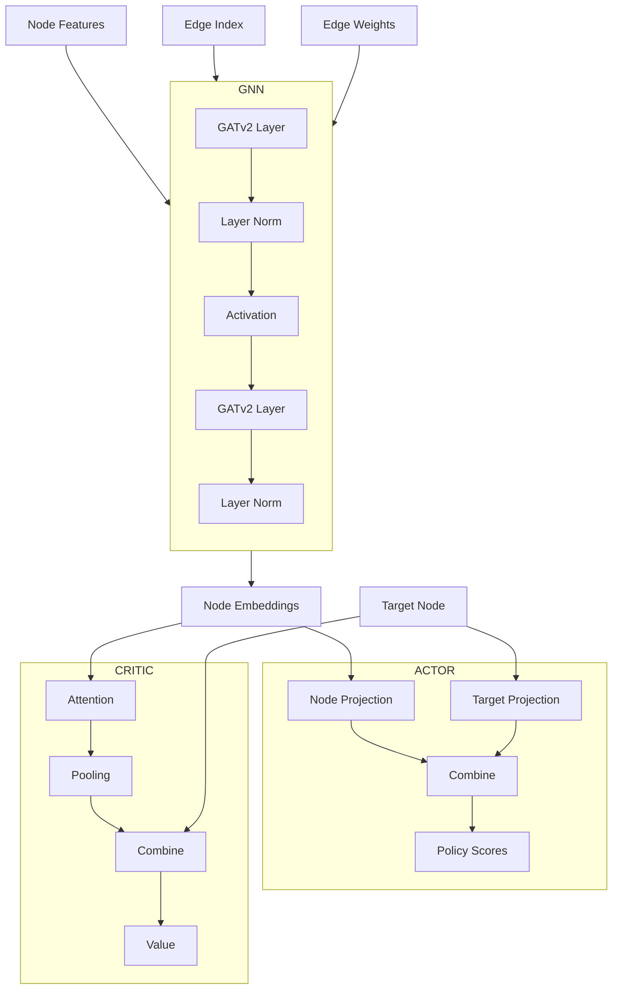

---

excalidraw-plugin: parsed
tags: [excalidraw]

---
==⚠  Switch to EXCALIDRAW VIEW in the MORE OPTIONS menu of this document. ⚠== You can decompress Drawing data with the command palette: 'Decompress current Excalidraw file'. For more info check in plugin settings under 'Saving'


# Code Block



# Excalidraw Data

## Text Elements
## Element Links
WLmth77V: [[Excalidraw/Drawing 2026-01-19 10.40.12.excalidraw.md#Code Block]]

%%
## Drawing
```compressed-json
N4KAkARALgngDgUwgLgAQQQDwMYEMA2AlgCYBOuA7hADTgQBuCpAzoQPYB2KqATLZMzYBXUtiRoIACyhQ4zZAHoFAc0JRJQgEYA6bGwC2CgF7N6hbEcK4OCtptbErHALRY8RMpWdx8Q1TdIEfARcZgRmBShcZQUebQBGABZtAAYaOiCEfQQOKGZuAG1wMFAwMogSbggAdQAZfXUAdkaANXSyyFhEKqzNBGJiXE1g9vLMbmcAVkbJ7USANkb5+cme

AGYADg34zf5ymAmNlIBOVJ55nnj4jZ5VjcS+YsgKEnVueJ5jte1JlMa1z5LRqJFIpNZ7SCSBCEZTSd6TDbzH6JRrXaY8RKJAEQiDWZQjNApHHMKCkNgAawQAGE2Pg2KQqgBiUEstI4zS4bDk5RkoQcYg0ukMiSk6zMOC4QK5UaQABmhHw+AAyrACehJJyNIEZRASWTKdVXpJ3sTSRSECqYGrdbTKjjebCOOF8mh4ji2BLsGoDq7QfbhPyncwXagO

EJFcSEP14ccwTjGCx2Fw0J9Hh0GExWJwAHKcMTcHgpEFrRIfNaTHFCOCDKDR11LLZrFKTNaNDaTRI4wjMAAimVrxG4soIYRxPOEcAAksQQwUALrsgPEACiwWyuVnC6eECIHHJVQKBWXOAIJHIFAUPfPhA4yl4KXOzhS8Wc8WOqHiKTmX4+2jcp88ChtH0YhGRpYgEFQAAhOkuTnOcdVgylBzQYd8FHbdmHccRUCKDowDdJ4CKeLd02wIQSQMHtcC

ibhSnTECAAUyTkOiiMgCiEAAeXsEgnD7YdwzyIcRwQCFyg5Llxz5YgAFkaOwSQqWsehQhE9CxPYiBJO5Xl+XkqBFNXLIcigbhSSETT8MgHTpP5QV6SZWVnJlCTOV0pcuM9b1uHmIktM0ekINIAyjLXUzzNISzxJsoKmAc4V0EZZzZVc2LSGCrzOR8wkYogeVgg4XBshabtCGGHC0LCIiAF8nhqrt+SwKpcDZbdZXIbJp24MNFWKOqwFI3E4DgFUa

Jw+joChbIqiIWEzL2BhCAQCgoPcuyBVpRyJGSlKXMW8jSClKBJ1rfQVX1aktsSiBGXiBB7vu0YIEO47TqyNapL0zahSqUUOHFSUIoOkQ3rOgAxBVlVVHCbQ8Z7XtM97zrNA0jQLEGjqRs6LvNS1rUEeHMbBrIACVhEdZ0TWKF7QexrIsq9WB3j9GnEdyZHwc4KBweKhUfVQCs2bpjmIe5pVCCMHDC2J+n9AAFSwKAAEE5uTdBgllBbhax0WsjG0g

VaOtgKChXAUNDcN8FlvX9GXflleN02Qgt3EnYRkWTrOx2yQoeX4Fh77nqwslFQADV8yZ4gSY5JijrZpnLVZFpD2l8AATW4cskWfX54nRHhLj+eZFqMNgDDY9NVN8HCvzj/qba9smlyDEMICDxaeRICWpYLfzyi74gVQQOBuCFgfSBIWS2Ag+2hmCC2qqsyBB4Syvyig2lXdIZQOQACkuRpqF4eIj5Ps+64ASh1UmEGUcNJSqHf9/WIleCbY/X+Pq

+IAbnXjtxpSLyUAkwhl6tbGmHVioIFvk1Set516QByPPOsqALLL0gNgIgo80DoJxEVGauCooYIgMIKAu4cLoL/uUOwAArBA2A8hKiKnAaes8ioVUXqJRanIQGMHluXfAiDoAByqGEYIjCkw6nIpRBWoi0DgJxEhVBS8cQdQMEqTIkjODqQwumfAoQVaSP4YInqVt+rgAanQAq4Q6J1RqkAA=
```
%%